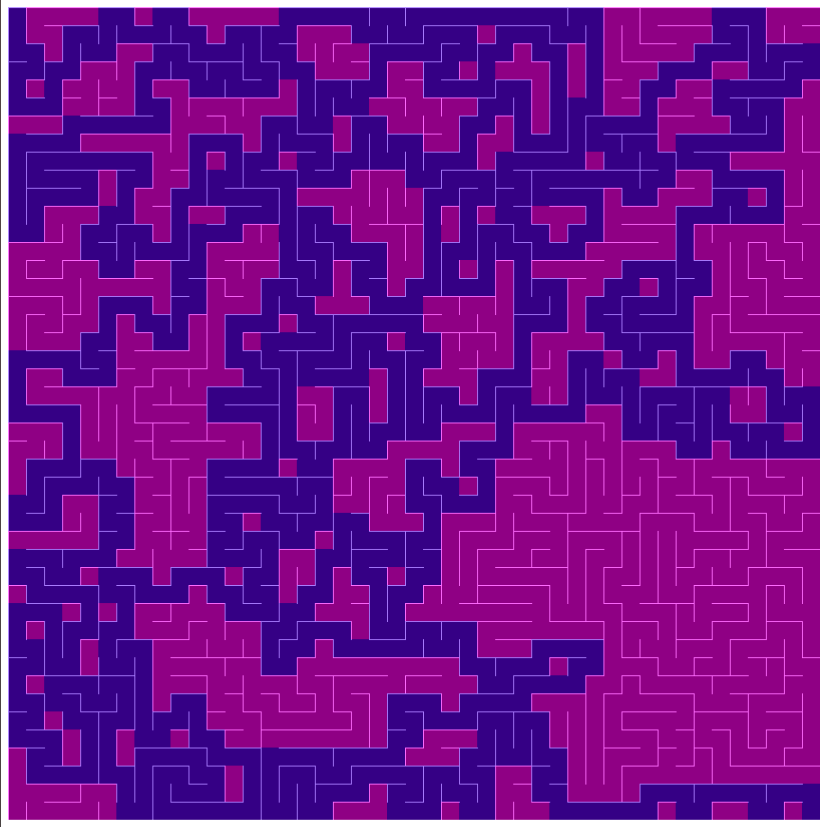

# Maze Generator
Simple application written in p5 js wich generates a maze and solves it using A* algorithm



# How to run
```
git clone https://github.com/ghassen-chetioui/maze-generator.git
cd maze-generator
npm run build
npm run serve
```
